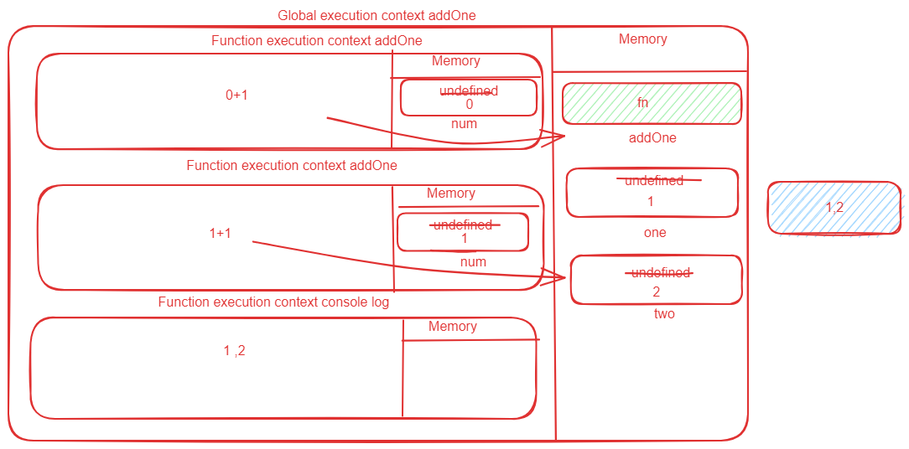
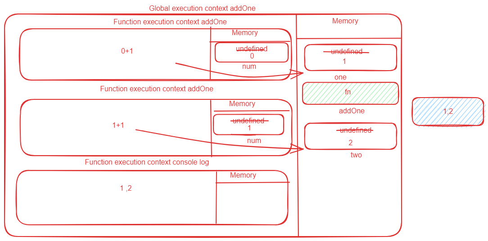
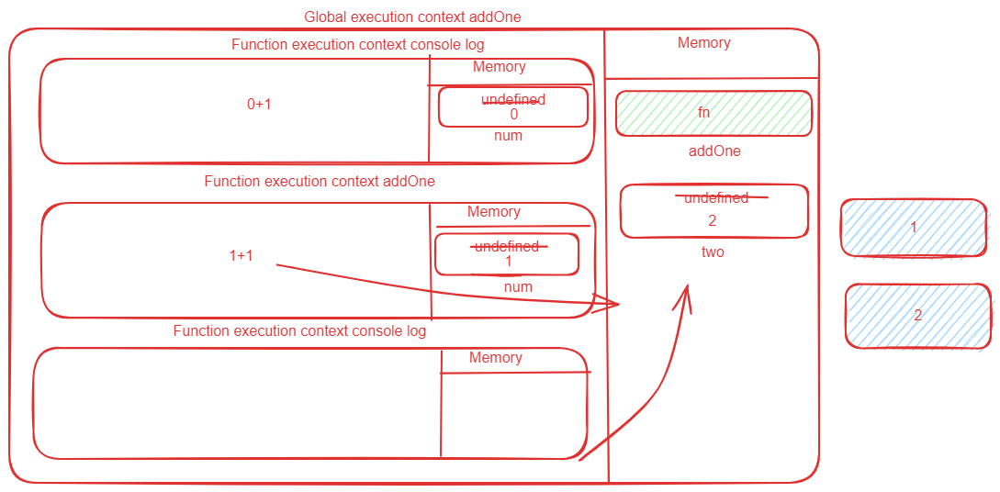
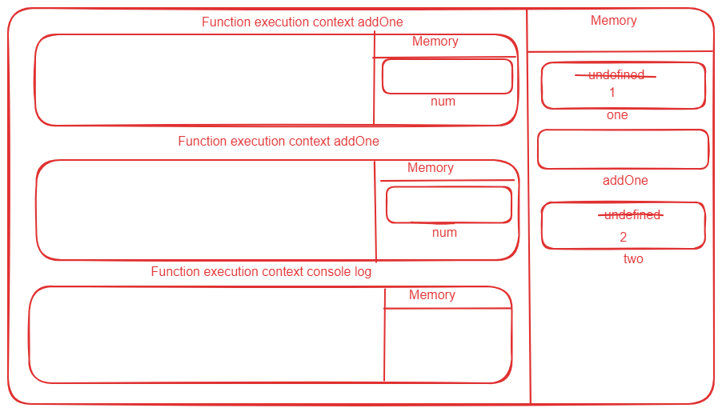

## Understanding Scope and the difference between var, let and const

Watch this video before doing the exercise: https://www.youtube.com/watch?v=XgSjoHgy3Rk

1. Guess the output:

```js
let firstName = 'Arya';
const lastName = 'Stark';
var knownAs = 'no one';

console.log(
  window.firstName,
  window.lastName,
  window.knownAs
);
// undefined undefined "no one"
```

2. Guess the output:

```js
let firstName = 'Arya';
const lastName = 'Stark';
var knownAs = 'no one';

function fullName(a, b) {
  return a + b;
}

console.log(window.fullName(firstName, lastName));
//"AryaStark"
```

3. Make a Execution Context Diagram for the following JS and write the output.

```js
function addOne(num){
  return num + 1;
}
var one = addOne(0);
var two = addOne(1);
console.log(one, two);
//1,2
```
;

4. Make a Execution Context Diagram for the following JS and write the output.

```js
var one = addOne(0);
fucntion addOne(num){
  return num + 1;
}
var two = addOne(1);
console.log(one, two);
// 1,2
```
;

5. Make a Execution Context Diagram for the following JS and write the output.

```js
console.log(addOne(0));
fucntion addOne(num){
  return num + 1;
}
var two = addOne(1);
console.log(two);
// 1,2
```
;

6. Make a Execution Context Diagram for the following JS and write the output.

```js
var one = addOne(0);
const addOne = (num) => {
  return num + 1;
};
var two = addOne(1);
console.log(two);
// ReferenceError
```
;

7. Make a Execution Context Diagram for the following JS and write the output.

```js
console.log(addOne(0));
const addOne = (num) => {
  return num + 1;
};
var two = addOne(1);
console.log(two);
// ReferenceError
```
;

8. What will be the output of the following

```js
function isAwesome() {
  var awesome;
  if (false) {
    awesome = true;
  }
  console.log(awesome);
}
isAwesome();
// Here is a isAwesome function is decleared  inside it we have variable called awesome which is derived with var keyword which initialized with undefined and the condition is false while console log it will log undefined.
// undefined
```

9. What will be the output of the following

```js
function isAwesome() {
  let awesome;
  if (true) {
    awesome = true;
  }
  console.log(awesome);
}
isAwesome();
// Here in this function isAwesome  has condition which is true which allow to execute and give the value of awesome that is true
// true
```

10. What will be the output of the following

```js
function isAwesome() {
  let awesome;
  if (false) {
    awesome = true;
  }
  console.log(awesome);
}
isAwesome();
// Here in function isAwesome we have condition ehich is false which means it never execute and we have awesome variable defined with let when it execute it store undefined so it give
//  undefined
```

11. What will be the output of the following

```js
let firstName = 'Arya';
const lastName = 'Stark';
var knownAs = 'no one';

function fullName(a, b) {
  return a + b;
}
const name = fullName(firstName, lastName);
console.log(name);
// here we are trying to console log name and in name we store the return value of function fullName which allow to access variable .
// AryaStark
```

12. Guess the output of the code below with a reason.

```js
function sayHello() {
  let name = 'Arya Stark';
}
sayHello();

console.log(name);
// Here we are trying to console log name name is defined inside function using let keyword which create block scope so it will not allow to access 
// name is not defined.
```

13. Guess the output of the code below with a reason.

```js
if (true) {
  var name = 'Arya Stark';
}
console.log(name);
// Var doesn't create a block scope so it will allow to use name variable 
//  Arya Stark
```

14. Guess the output of the code below with a reason.

```js
if (true) {
  let name = 'Arya Stark';
}
console.log(name);
// Here condition is true but let create block scope and we are trying to console log name which we cant from outside it will give nothing. 

```

15. Guess the output of the code below with a reason.

```js
for (var i = 0; i < 20; i++) {
  //
}
console.log(i);
// Here inside for loop we declered i variable with var keyword which doesn't create a block scope so we can easily console log the value of i  
// 20
```

16. Guess the output of the code below with a reason.

```js
for (let i = 0; i < 20; i++) {
  //
}
console.log(i);
// Inside for loop we create a variable i with let keyword which create block scope and we are trying to access value of i from outside which give  error.
// ReferenceError: i is not defined
```

17. Guess the output and the reason behind that.

```js
function sample() {
  if (true) {
    var username = 'John Snow';
  }
  console.log(username);
}
sample();
// Var doesnot create a block scope of while console log we are able to access  value of username
//  John Snow
```

18. Guess the output and the reason behind that.

```js
function sample() {
  if (true) {
    let username = 'John Snow';
  }
  console.log(username);
}
sample();
// Here sample function has if condition inside condition we declered username with let keyword  and let create a block scope and from outside we are trying to console log (we are trying to inter inside scope from outside).
// ReferenceError: username is not defined
```

19. Guess the output and the reason behind that.

```js
function sample() {
  var username = 'Arya Stark';
  if (true) {
    var username = 'John Snow';
    console.log(username);
  }
  console.log(username, 'second');
}
sample();
// Here in function sample  both of the username variable is defined using var one is inside if condition which is not a block scope when we try to console log both of them it will give John Snow  and both of the variable are decleared with var so it will
// John Snow
// John Snow second
```

20. Guess the output and the reason behind that.

```js
function sample() {
  let username = 'Arya Stark';
  if (true) {
    let username = 'John Snow';
    console.log(username, 'first');
  }
  console.log(username, 'second');
}
sample();
// Here inside function sample we decleared username variable and  condition  inside if condition we have again username variable and we are trying to console log it will create block scope because variable is defined using let keywordso it will search username inside that scope and console log it  outer of this scope we again try to console log   it will try to search username in theitr respective scope.
// John Snow first
// Arya Stark second
```

21. Guess the output and the reason behind that.

```js
function sample(...args) {
  for (let i = 0; i < args.length; i++) {
    let message = `Hello I am ${args[i]}`;
    console.log(message);
  }
}

sample('First', 'Second', 'Third');
// Here function sample accept all the arrays and loop over these arrays and store message in the message variable and try to console log so we got value of every itteration.
// Hello I am First
//  Hello I am Second
// Hello I am Third
```

22. Guess the output and the reason behind that.

```js
function sample(...args) {
  for (let i = 0; i < args.length; i++) {
    const message = `Hello I am ${args[i]}`;
    console.log(message);
  }
}

sample('First', 'Second', 'Third');
// Here function sample accept all the arrays and loop over these arrays and store message in the message variable and try to console log so we got value of every itteration.
// Hello I am First
// Hello I am Second
// Hello I am Third
```

23. Guess the output and the reason behind that.

```js
if (true) {
  const myFunc = function () {
    console.log(username, 'Second');
  };
  console.log(username, 'First');
  let username = 'Hello World!';
  myFunc();
}
// In this code we  decleared myFunc function using const which create empty box and nother we are trying to console log username before initalization  of username. so it will throw an Reference Error.
// ReferenceError: Cannot access 'username' before initialization
```

24. Guess the output and the reason behind that.

```js
function outer() {
  let movie = 'Mad Max: Fury Road';
  function inner() {
    console.log(
      `I love this movie called ${movie.toUpperCase()}`
    );
  }
  inner();
}

outer();
// Here is a function outer inside outer function we have variable movie and another function inner inside inner we are trying to console log with movie variable  it tries to search inside inner function but there is no any variable of movie so it's bubble out to search variable movie and found it so its console log  
// I love this movie called MAD MAX: FURY ROAD
```

25. Guess the output and the reason behind that.

```js
function outer() {
  let movie = 'Mad Max: Fury Road';
  function inner() {
    let movie = 'Before Sunrise';
    console.log(
      `I love this movie called ${movie.toUpperCase()}`
    );
  }
  inner();
}

outer();
// I love this movie called BEFORE SUNRISE.
// Here we have function outer with the variable movie which is created using let keyword inside outer we have another function inner  which hade same variable and inside inner we are trying to console log let create block scope and it will search movie variable inside it's scope and found it so it will log  I love this movie called BEFORE SUNRISE.  
```

26. Guess the output and the reason behind that.

```js
function outer() {
  let movie = 'Mad Max: Fury Road';
  function inner() {
    let movie = 'Before Sunrise';
    function extraInner() {
      let movie = 'Gone Girl';
      console.log(
        `I love this movie called ${movie.toUpperCase()}`
      );
    }
    extraInner();
  }
  inner();
}
outer();
// I love this movie called GONE GIRL.
//  We are trying to console log inside extraInner in which movie is decleared with help of let keyword which create block scope  and  in console log its prefered the value which is declered inside it.
```

30. Using reduce find the final value when the initial value passed is `100`. You have to pass the output of one function into the input of next function in the array `allFunctions` starts with `addOne` ends with `half`.

```js
const addOne = (num) => {
  return num + 1;
};
const subTwo = (num) => {
  return num - 2;
};
const multiplyThree = (num) => {
  return num * 3;
};
const half = (num) => {
  return num / 2;
};

let allFunctions = [
  addOne,
  subTwo,
  multiplyThree,
  addOne,
  multiplyThree,
  half,
];
allFunctions.reduce((acc,cv)=>cv(acc),100);

// Answer is: 447
```
